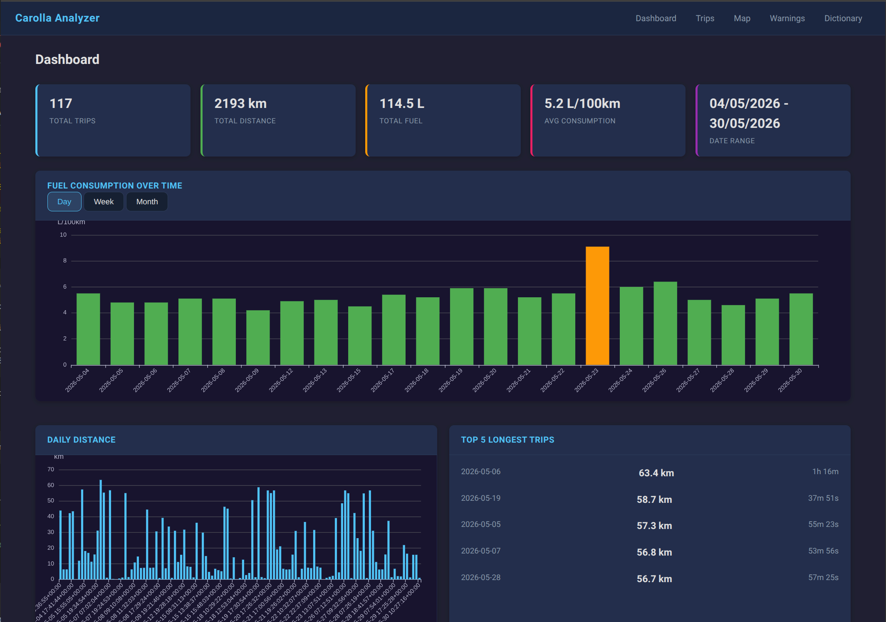
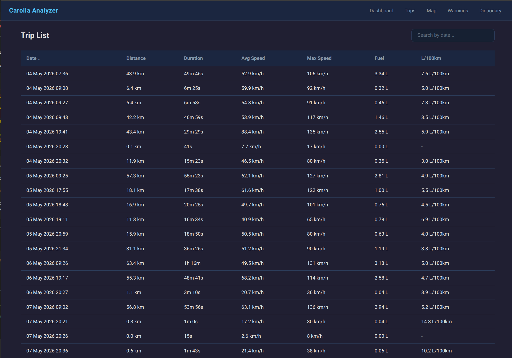
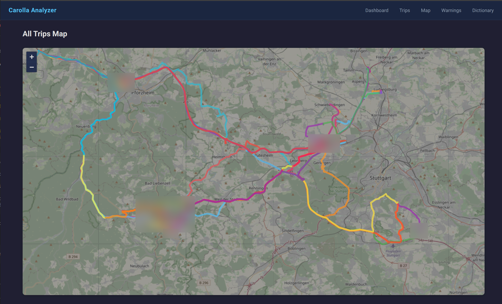
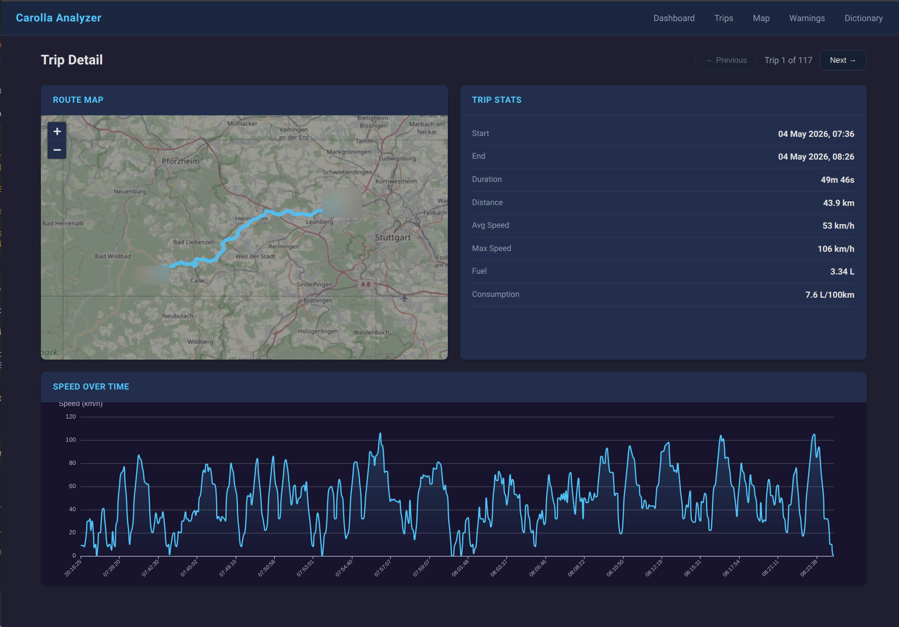

# Carolla Analyzer

Client-side CSV analyzer for Toyota Corolla telemetry data. Upload a .zip exported from the car's ECU to visualize trips on a map, inspect speed/fuel charts, and review warning events.

Built with vanilla JS, Leaflet, ECharts, and PapaParse. All processing happens in the browser — no data is sent to a server.

## Screenshots

| Dashboard | Trips |
|---|---|
|  |  |

| Map | Trip Detail |
|---|---|
|  |  |

## Usage

Open the app at [spacefish.github.io/carolla-analyzer](https://spacefish.github.io/carolla-analyzer/), upload a .zip, and browse the dashboard.

## Development

```sh
npm ci
npm run dev     # dev server on port 3000
npm run build   # production build to dist/
```
